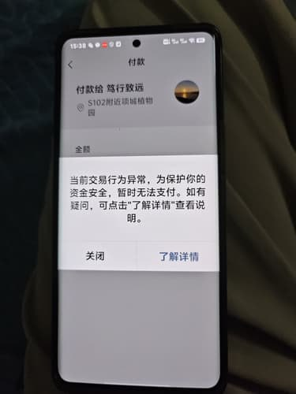

# Windows 10 OCR 程序使用教程

## 快速开始

### 系统要求
- **操作系统**: Windows 10 23H2 或更高版本
- **SnippingTool**: 版本 10.2409.25.0 或更高
- **处理器**: x64 架构
- **内存**: 至少 4GB RAM
- **存储**: 至少 500MB 可用空间

### 环境依赖

#### 1. Visual C++ 运行库
确保系统已安装 Microsoft Visual C++ 2022 Redistributable (x64)

#### 2. 必需的 DLL 文件
程序运行需要以下文件与 `ocr.exe` 在同一目录：

| 文件名 | 说明 | 大小 |
|--------|------|------|
| `oneocr.dll` | OCR 引擎核心库 | ~2MB |
| `oneocr.onemodel` | OCR AI 模型文件 | ~50MB |
| `onnxruntime.dll` | ONNX 运行时库 | ~15MB |
| `opencv_world4110.dll` | OpenCV 图像处理库 | ~80MB |

#### 3. 使用教程


### 基本使用

#### 1. 命令行语法
```bash
ocr.exe <图片文件路径> 
```

#### 2. 使用示例
```bash
# 识别当前目录下的图片
ocr.exe image.jpg

# 识别指定路径的图片
ocr.exe "C:\Users\Username\Pictures\screenshot.png"


```

### 识别效果展示

#### 支持的图像格式
- **PNG** - 推荐，无损压缩，识别效果最佳
- **JPG/JPEG** - 常用格式，效果良好
- **BMP** - 位图格式，文件较大但效果佳
- **TIFF** - 专业图像格式，适合扫描文档

#### 识别准确率
根据图像质量和文字清晰度：

| 图像类型 | 预期准确率 | 最佳条件 |
|----------|------------|----------|
| 清晰屏幕截图 | 95-99% | 黑白文字，标准字体 |
| 扫描文档 | 90-95% | 300DPI以上，文字清晰 |
| 手机拍照 | 80-90% | 光线充足，无模糊 |
| 复杂背景 | 70-85% | 文字与背景对比度高 |

#### 识别示例

**原图像**:


**识别命令**:
```bash
ocr.exe 1.jpg
```

**输出结果**:
```
OCR model loaded...
Running ocr pipeline...
Recognize 11 lines
付款
く
付款给 笃行致远
S102附近讀城植物
金膜
当前交易行为异常,为保护你的
资金安全,暂时无法支付。如有
疑问,可点击"了解详情"查看说
明。
关闭
了解详情

OCR results saved to ocr_result_1751287558.txt.
```

### 输出文件说明

#### 1. OCR结果文件
- **文件名**: `ocr_result_<时间戳>.txt`
- **编码**: UTF-8 with BOM
- **内容**: 识别出的所有文字，按行分隔

#### 2. 运行计数文件
- **文件名**: `run_count.dat`
- **用途**: 记录程序运行次数
- **格式**: 二进制文件，包含整数计数


## 故障排除

### 常见问题

#### 1. "Failed to load DLL" 错误
**原因**: 缺少必需的DLL文件  
**解决**: 确保所有依赖文件在程序目录下

#### 2. "can't read image!" 错误
**原因**: 图像文件路径错误或格式不支持  
**解决**: 检查文件路径和格式

#### 3. 识别结果乱码
**原因**: 控制台编码问题  
**解决**: 使用支持UTF-8的终端或查看输出文件

#### 4. 程序卡住不响应
**原因**: 可能在等待远程文件下载  
**解决**: 检查网络连接，或等待超时

### 性能优化建议

1. **图像预处理**: 提高图像对比度和清晰度
2. **文件大小**: 控制图像文件大小在10MB以内
3. **分辨率**: 推荐300DPI以上的扫描分辨率
4. **文字大小**: 确保文字高度至少12像素

## 技术支持

- **项目地址**: [GitHub Repository]

---


